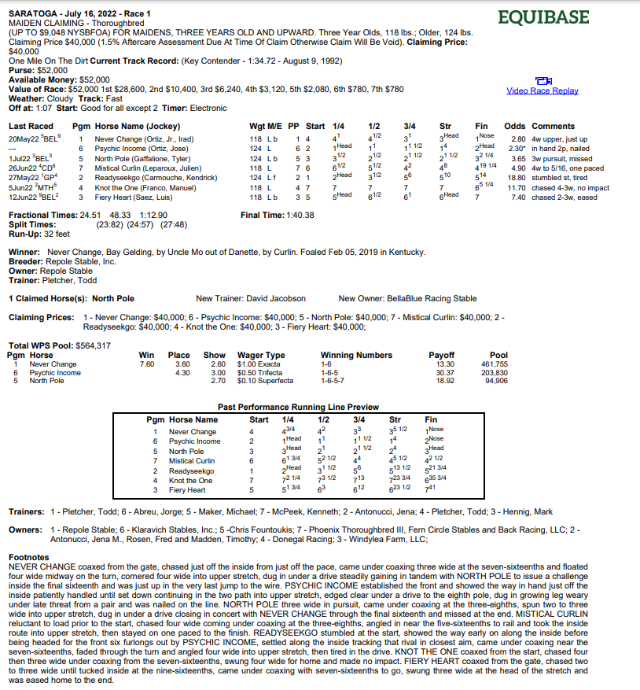

  

<h1 style="text-align:center;">NYRA Bias</h1>

## WebApp
<table>
<tr>
<td>
  A web app that uses a web crawler, custom pdf parser, and a REST API to automatically download New York Racing Association race charts and store relevant data.  Paired with a UI with custom search paramaters, the app allows users to uncover potential historical track biases at various distances and surfaces at Aqueduct, Saratoga, and Belmont Park
</td>
</tr>
</table>

## Built With

[![Python][Python.io]][Python-url] [![Django][Django.io]][Django-url]
[![HTML][HTML5.io]][HTML5-url] [![CSS][CSS.io]][CSS-url]
[![JavaScript][JavaScript.io]][JavaScript-url]
[![Postgresql][Postgresql.io]][Postgresql-url]

## Site
[Website link](https://nyra-bias.onrender.com/)

### Landing Page
Currently working for all tracks and dates from Jan '21 on, but will be updated to add 10 years of data soon.

## Demo
site demo

<!-- ### Example Equibase Chart
 -->

## Compatability
The WebApp is compatible with the most common web browsers.

## Usage

<!-- MARKDOWN LINKS & IMAGES -->
[Python-url]: https://www.python.org/
[Python.io]: https://img.shields.io/badge/Python-14354C?style=for-the-badge&logo=python&logoColor=white
[Django-url]: https://www.djangoproject.com/
[Django.io]: https://img.shields.io/badge/Django-092E20?style=for-the-badge&logo=django&logoColor=white
[HTML5-url]: https://developer.mozilla.org
[HTML5.io]: https://img.shields.io/badge/HTML5-E34F26?style=for-the-badge&logo=html5&logoColor=white
[CSS-url]: https://developer.mozilla.org
[CSS.io]: https://img.shields.io/badge/CSS3-1572B6?style=for-the-badge&logo=css3&logoColor=white
[JavaScript-url]: https://www.javascript.com/
[JavaScript.io]: https://img.shields.io/badge/JavaScript-323330?style=for-the-badge&logo=javascript&logoColor=F7DF1E
[Postgresql-url]: https://www.postgresql.org/
[Postgresql.io]: https://img.shields.io/badge/PostgreSQL-316192?style=for-the-badge&logo=postgresql&logoColor=white
